# Banco de dados - SQL 	:books:

# Cenário :bookmark_tabs:

A empresa "Banco Tech" está buscando a implementação de um novo sistema de controle bancário para aprimorar suas operações diárias, melhorar a eficiência do atendimento ao cliente e garantir maior segurança no gerenciamento de dados financeiros. Este sistema terá como foco principal a gestão de clientes, suas contas, transações financeiras e produtos financeiros oferecidos pelo banco.
As principais funcionalidades do banco de dados dessa empresa incluem clientes, contas bancárias, transações financeiras, produtos financeiros e funcionários. Com campos específicos que armazenam informações relevantes para o funcionamento do banco.
Um cliente pode ter uma ou várias contas bancárias, e cada conta bancária está associada a um único cliente. Da mesma forma, uma transação financeira está vinculada a uma conta bancária específica.
Além disso, o sistema contempla a oferta de produtos financeiros, como empréstimos pessoais e investimentos em renda fixa, e os clientes podem aderir a esses produtos.

# Modelagem Conceitual 	:card_index_dividers:

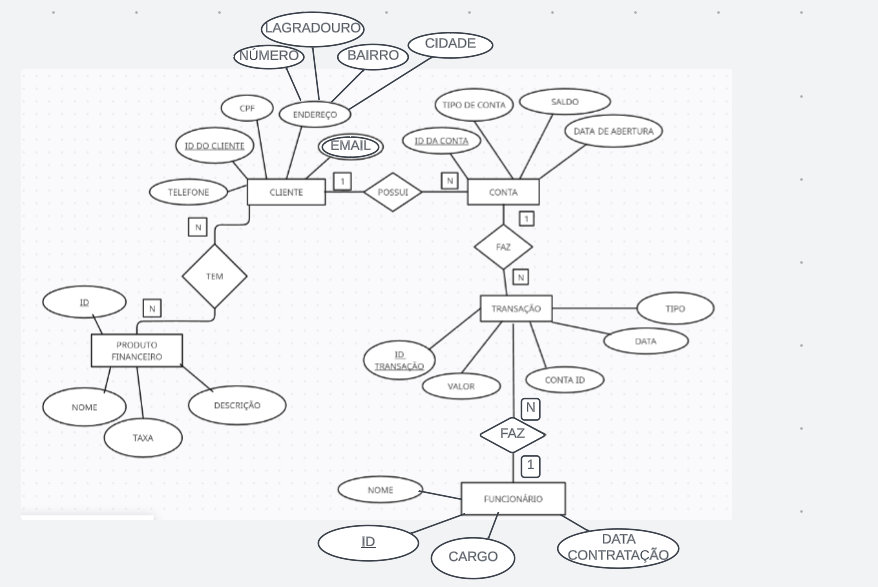

# Modelagem Lógica 	:card_index_dividers:

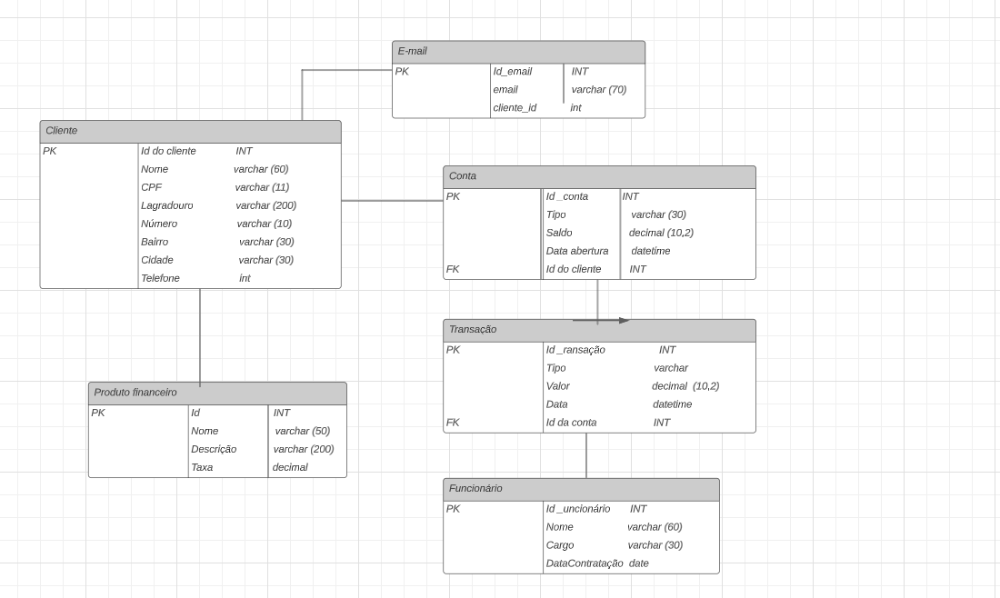

# Dados 	:bar_chart:
use banco
go

CREATE TABLE cliente (
	id_cliente int primary key identity,
	nome varchar (60),
	cpf varchar (11),
	lagradouro varchar (200),
	numero varchar (10),
	bairro varchar (30),
	cidade varchar (30),
	telefone varchar (15),
)

INSERT INTO cliente (nome, cpf, lagradouro, numero, bairro, cidade, telefone)
VALUES
('João Silva', '12345678901', 'Rua A', '123', 'paulista', 'franca', '1234567890'),
('Maria Oliveira', '98765432101', 'Rua B', '456', 'centro', 'sao paulo', '9876543210'),
('Ana Santos', '11122233344', 'Rua C', '789', 'paraiso', 'rio de janeiro', '1112223334'),
('Carlos Pereira', '55566677788', 'Rua D', '101', 'liberdade', 'sao paulo', '5556667778'),
('Fernanda Lima', '99988877766', 'Rua E', '202', 'bela vista', 'curitiba', '9998887776'),
('José Oliveira', '44455566677', 'Rua F', '303', 'santana', 'sao paulo', '4445556667'),
('Amanda Souza', '88877766655', 'Rua G', '404', 'itaim', 'sao paulo', '8887776665'),
('Rafaela Costa', '33344455566', 'Rua H', '505', 'pinheiros', 'sao paulo', '3334445556'),
('Lucas Martins', '77788899900', 'Rua I', '606', 'moema', 'sao paulo', '7778889990'),
('Roberto Pereira', '22211100099', 'Rua J', '707', 'vila madalena', 'sao paulo', '2221110009'),
('Patrícia Lima', '66677788811', 'Rua K', '808', 'santo amaro', 'sao paulo', '6667778881'),
('Eduardo Silva', '11100099988', 'Rua L', '909', 'morumbi', 'sao paulo', '1110009998'),
('Camila Oliveira', '99988877766', 'Rua M', '1010', 'jardins', 'sao paulo', '9998887776'),
('Fábio Santos', '44455566677', 'Rua N', '1111', 'butanta', 'sao paulo', '4445556667'),
('Isabela Costa', '77788899900', 'Rua O', '1212', 'barra funda', 'sao paulo', '7778889990'),
('Marcelo Lima', '22211100099', 'Rua P', '1313', 'cidade tiradentes', 'sao paulo', '2221110009'),
('Carla Pereira', '66677788811', 'Rua Q', '1414', 'campo belo', 'sao paulo', '6667778881'),
('Gustavo Oliveira', '11100099988', 'Rua R', '1515', 'brooklin', 'sao paulo', '1110009998'),
('Larissa Silva', '99988877766', 'Rua S', '1616', 'itaquera', 'sao paulo', '9998887776'),
('Vinícius Costa', '44455566677', 'Rua T', '1717', 'mooca', 'sao paulo', '4445556667');

SELECT * from cliente;

CREATE TABLE conta (
    id_conta INT PRIMARY KEY IDENTITY,
    tipo VARCHAR(30),
    saldo DECIMAL(10, 2),
    data_abertura DATE,
    id_cliente INT,
    FOREIGN KEY (id_cliente) REFERENCES cliente (id_cliente)
);

INSERT INTO conta (tipo, saldo, data_abertura, id_cliente)
VALUES
('Corrente', 5000.00, '2023-01-01', 1),
('Poupança', 10000.00, '2023-01-02', 2),
('Corrente', 7000.00, '2023-01-01', 3),
('Poupança', 12000.00, '2023-01-02', 4),
('Corrente', 9000.00, '2023-01-01', 5),
('Poupança', 16000.00, '2023-01-02', 6),
('Corrente', 5500.00, '2023-01-01', 7),
('Poupança', 17000.00, '2023-01-02', 8),
('Corrente', 5090.00, '2023-01-01', 9),
('Poupança', 10850.00, '2023-01-02', 10),
('Corrente', 51000.00, '2023-01-01', 11),
('Poupança', 106000.00, '2023-01-02', 12),
('Corrente', 26000.00, '2023-01-01', 13),
('Poupança', 14000.00, '2023-01-02', 14),
('Corrente', 5000.00, '2023-01-01', 15),
('Poupança', 10800.00, '2023-01-02', 16),
('Corrente', 50450.00, '2023-01-01', 17),
('Poupança', 105600.00, '2023-01-02', 18),
('Corrente', 50990.00, '2023-01-01', 19),
('Poupança', 10750.00, '2023-01-02', 20);

SELECT * from conta;

CREATE TABLE transacao (
    id_transacao INT PRIMARY KEY IDENTITY,
    tipo VARCHAR(20),
    valor DECIMAL(10, 2),
    data DATETIME,
    id_conta INT,
    FOREIGN KEY (id_conta) REFERENCES conta (id_conta)
);

INSERT INTO transacao (tipo, valor, data, id_conta)
VALUES
('Depósito', 800.00, '2023-01-03T10:30:00', 1),
('Saque', 500.00, '2023-01-04T14:15:00', 2),
('Depósito', 800.00, '2023-01-05T11:45:00', 3),
('Saque', 200.00, '2023-01-06T16:20:00', 4),
('Depósito', 1200.00, '2023-01-07T09:10:00', 5),
('Saque', 700.00, '2023-01-08T13:30:00', 6),
('Depósito', 1500.00, '2023-01-09T14:45:00', 7),
('Saque', 300.00, '2023-01-10T12:15:00', 8),
('Depósito', 900.00, '2023-01-11T10:00:00', 9),
('Saque', 600.00, '2023-01-12T15:40:00', 10),
('Depósito', 1800.00, '2023-01-13T11:20:00', 11),
('Saque', 400.00, '2023-01-14T14:50:00', 12),
('Depósito', 2000.00, '2023-01-15T09:30:00', 13),
('Saque', 100.00, '2023-01-16T13:00:00', 14),
('Depósito', 2200.00, '2023-01-17T10:15:00', 15),
('Saque', 800.00, '2023-01-18T15:25:00', 16),
('Depósito', 2500.00, '2023-01-19T12:05:00', 17),
('Saque', 1000.00, '2023-01-20T14:35:00', 18),
('Depósito', 3000.00, '2023-01-21T11:55:00', 19),
('Saque', 1200.00, '2023-01-22T16:05:00', 20);

SELECT * FROM transacao

CREATE TABLE produto_financeiro
(
    id_produto INT PRIMARY KEY IDENTITY,
    nome VARCHAR(50),
    descricao VARCHAR(200),
    taxa_juros DECIMAL(5, 2),
	PRIMARY KEY (id_produto)
);

INSERT INTO produto_financeiro (nome, descricao, taxa_juros)
VALUES
('Empréstimo Pessoal', 'Empréstimo com juros baixos', 8.5),
('Investimento Renda Fixa', 'Investimento seguro', 6.0),
('Cartão de Crédito', 'Parcelamento sem juros', 12.0),
('Financiamento Imobiliário', 'Crédito para aquisição de imóveis', 7.0),
('Poupança Programada', 'Poupança com depósitos mensais', 4.5),
('Seguro de Vida', 'Proteção financeira para a família', 5.8),
('Consórcio Automotivo', 'Compra planejada de veículos', 9.2),
('Conta Corrente Universitária', 'Conta para estudantes', 0.0),
('CDB (Certificado de Depósito Bancário)', 'Renda fixa com liquidez', 5.5),
('Previdência Privada', 'Investimento para aposentadoria', 8.0),
('Seguro Residencial', 'Proteção para sua moradia', 4.2),
('Crédito Consignado', 'Empréstimo com desconto em folha', 7.5),
('Investimento em Ações', 'Participação em empresas', 10.3),
('Cheque Especial', 'Crédito adicional na conta corrente', 14.0),
('Cartão de Débito Internacional', 'Facilidade em transações internacionais', 0.0),
('Consórcio de Imóveis', 'Compra planejada de imóveis', 8.8),
('Microcrédito', 'Pequenos empréstimos para empreendedores', 15.5),
('Investimento em Ouro', 'Proteção contra variações do mercado', 7.7);

SELECT * FROM produto_financeiro

CREATE TABLE funcionario
(
    id_funcionario INT PRIMARY KEY IDENTITY,
    nome VARCHAR(60),
    cargo VARCHAR(30),
    data_contratacao DATE
);

INSERT INTO funcionario (nome, cargo, data_contratacao)
VALUES
('Carlos Pereira', 'Gerente de Contas', '2022-01-15'),
('Ana Oliveira', 'Atendente', '2022-03-20'),
('Mariana Silva', 'Analista Financeiro', '2022-02-10'),
('Pedro Santos', 'Atendente', '2022-04-05'),
('Camila Oliveira', 'Gerente de Contas', '2022-01-22'),
('Roberto Pereira', 'Analista Financeiro', '2022-03-25'),
('Larissa Costa', 'Atendente', '2022-05-12'),
('Lucas Martins', 'Gerente de Contas', '2022-02-18'),
('Amanda Souza', 'Analista Financeiro', '2022-04-15'),
('Fábio Santos', 'Atendente', '2022-06-01'),
('Isabela Costa', 'Gerente de Contas', '2022-02-28'),
('Marcelo Lima', 'Analista Financeiro', '2022-04-20'),
('Carla Pereira', 'Atendente', '2022-06-15'),
('Gustavo Oliveira', 'Gerente de Contas', '2022-03-10'),
('Larissa Silva', 'Analista Financeiro', '2022-05-25'),
('Vinícius Costa', 'Atendente', '2022-07-01'),
('Patrícia Lima', 'Gerente de Contas', '2022-03-15'),
('Eduardo Silva', 'Analista Financeiro', '2022-06-10'),
('Fernanda Oliveira', 'Atendente', '2022-07-20'),
('Rafael Silva', 'Analista Financeiro', '2022-08-05');

SELECT * FROM funcionario

CREATE TABLE cliente_produto_financeiro
(
    id_cliente INT,
    id_produto INT,
    PRIMARY KEY (id_cliente, id_produto),
    FOREIGN KEY (id_cliente) REFERENCES cliente (id_cliente),
    FOREIGN KEY (id_produto) REFERENCES produto_financeiro (id_produto)
);
 
INSERT INTO cliente_produto_financeiro (id_cliente, id_produto)
VALUES
(1, 7),
(2, 9),
(3, 5),
(4, 9),
(5, 18),
(6, 16),
(7, 3),  
(8, 5),  
(9, 9),  
(10, 7), 
(11, 9),
(12, 2), 
(13, 10), 
(14, 15),
(15, 11), 
(16, 2), 
(17, 1),
(18, 6),
(19, 7), 
(20, 18);

SELECT id_cliente FROM cliente_produto_financeiro where id_produto = 6;

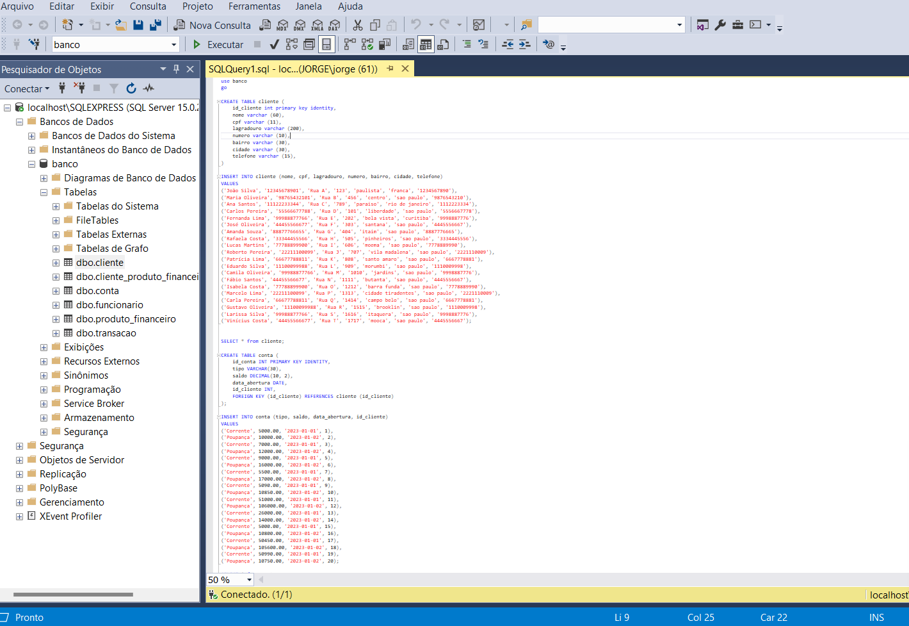

# Relatórios :memo:

:desktop_computer: Consulta 1: Informações Detalhadas do Cliente e suas Contas:

SELECT c.id_cliente, c.nome, c.cpf, cb.id_conta, cb.tipo, cb.saldo
FROM cliente c
JOIN conta cb ON c.id_cliente = cb.id_cliente;

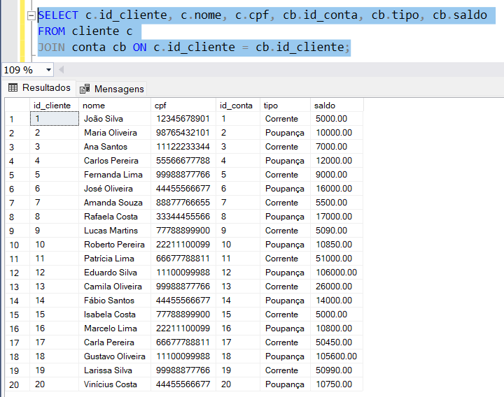

:desktop_computer: Consulta 2: Transações Realizadas por um Cliente:
SELECT c.nome, t.id_transacao, t.tipo, t.valor, t.data
FROM cliente c
JOIN conta cb ON c.id_cliente = cb.id_cliente
JOIN transacao t ON cb.id_conta = t.id_conta
WHERE c.nome = 'João Silva';

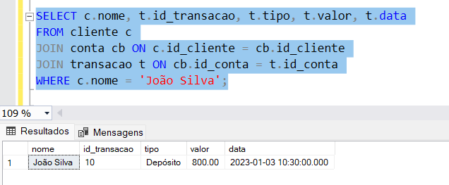

:desktop_computer: Consulta 3: Produtos Financeiros Associados a uma Conta Bancária:
SELECT c.nome, cb.id_conta, pf.nome AS produto_financeiro
FROM cliente c
JOIN conta cb ON c.id_cliente = cb.id_cliente
JOIN cliente_produto_financeiro cpf ON c.id_cliente = cpf.id_cliente
JOIN produto_financeiro pf ON cpf.id_produto = pf.id_produto;

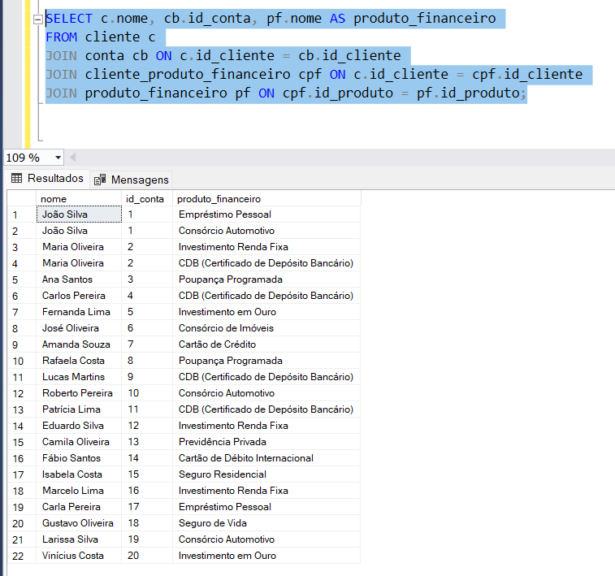

:desktop_computer: Consulta 4: Saldo Atual de Todas as Contas Bancárias:

SELECT cb.id_conta, c.nome, cb.saldo
FROM conta cb
JOIN cliente c ON cb.id_cliente = c.id_cliente
ORDER BY cb.saldo DESC;

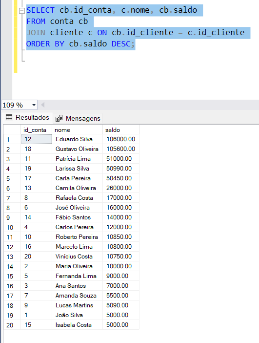

:desktop_computer: Consulta 5: Histórico de Transações por Tipo e Valor:

SELECT t.tipo, t.valor, t.data, c.nome AS cliente, cb.id_conta
FROM transacao t
JOIN conta cb ON t.id_conta = cb.id_conta
JOIN cliente c ON cb.id_cliente = c.id_cliente
WHERE t.tipo = 'Depósito' AND t.valor > 1000
ORDER BY t.data DESC;

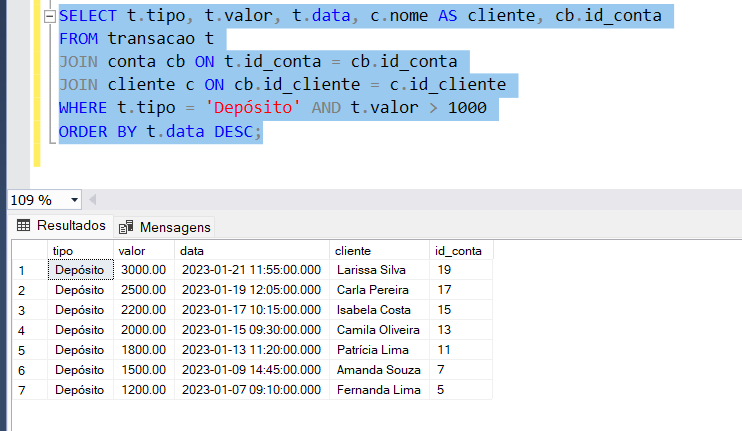

:desktop_computer: Consulta 6: Produtos Financeiros com Taxa de Juros Superior a 7%

SELECT nome, descricao, taxa_juros
FROM produto_financeiro
WHERE taxa_juros > 7;

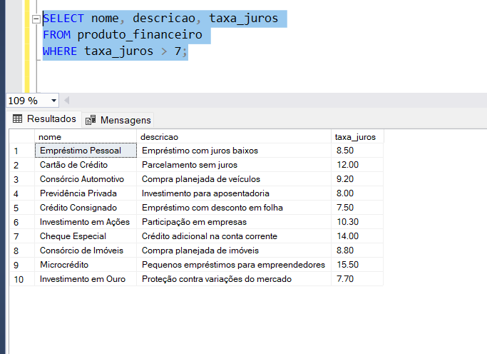

:desktop_computer: Consulta 7: Clientes que Adquiriram Produtos Financeiros:

SELECT c.nome, pf.nome AS produto_financeiro
FROM cliente c
JOIN cliente_produto_financeiro cpf ON c.id_cliente = cpf.id_cliente
JOIN produto_financeiro pf ON cpf.id_produto = pf.id_produto;

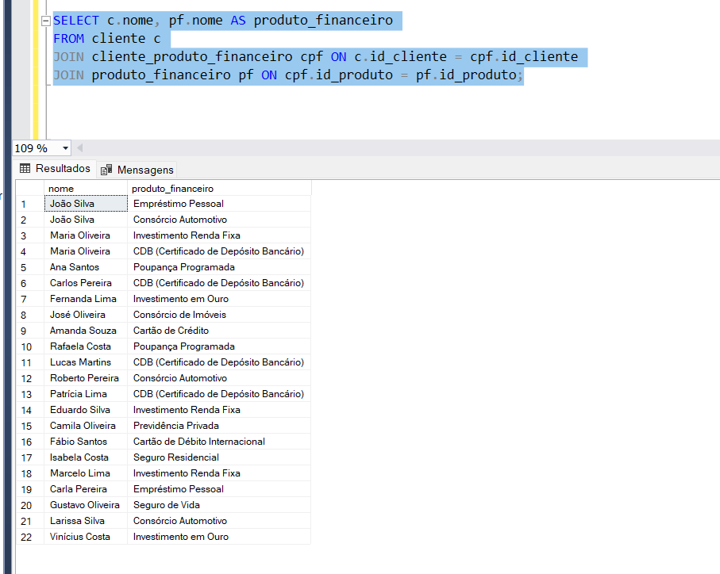

:desktop_computer: Consulta 8: Lista de funcionários ordenados por data de contratação (do mais novo para o mais antigo):

SELECT nome, data_contratacao
FROM funcionario
ORDER BY data_contratacao DESC;

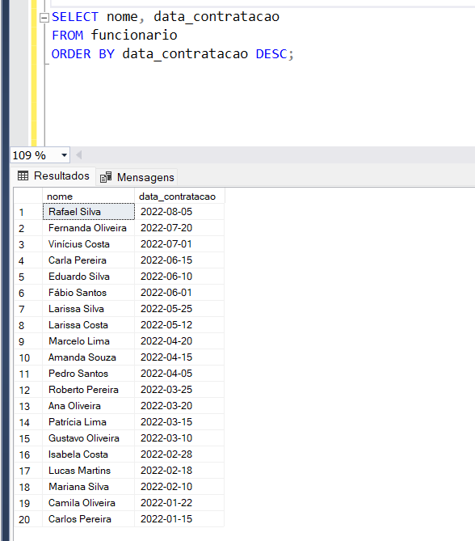

:desktop_computer: Consulta 9: Soma total do saldo de todas as contas:

SELECT SUM(saldo) AS saldo_total
FROM conta;

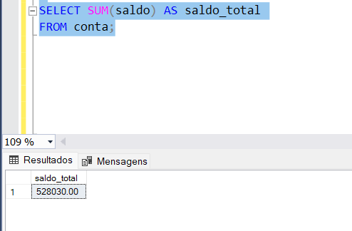

:desktop_computer: Consulta 10: Funcionários que são Gerentes de Contas

SELECT *
FROM funcionario
WHERE cargo = 'Gerente de Contas';

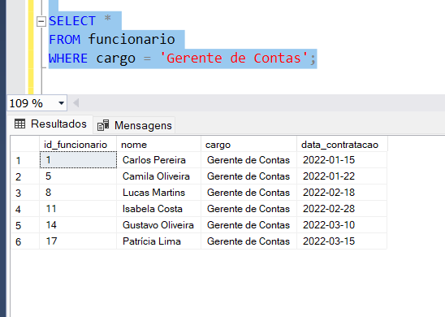

